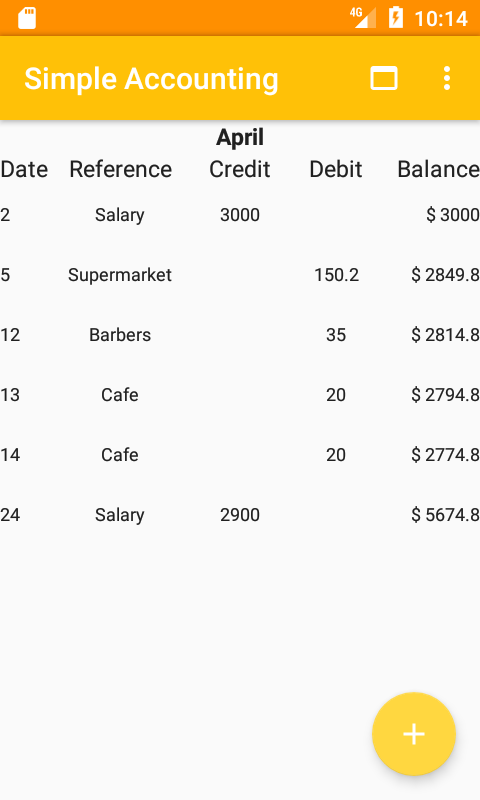
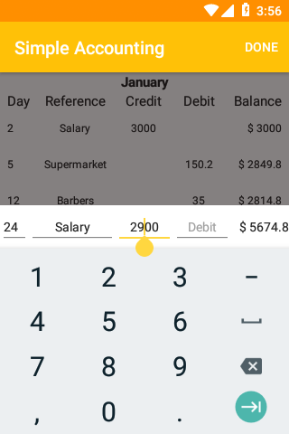
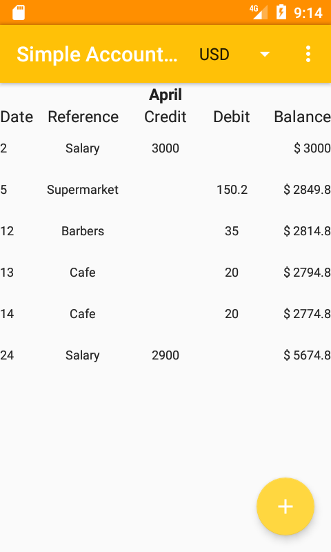
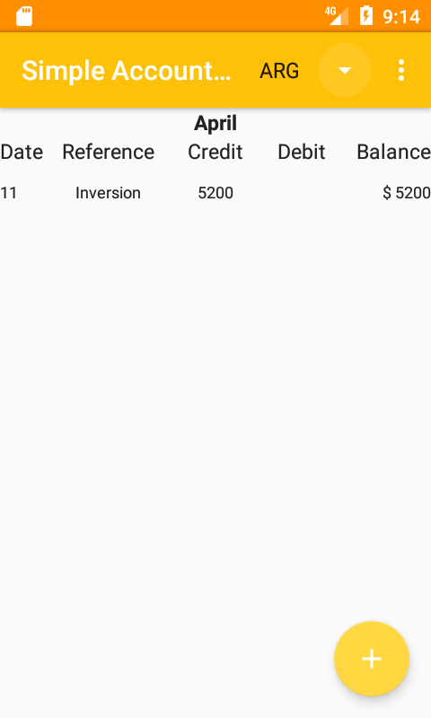
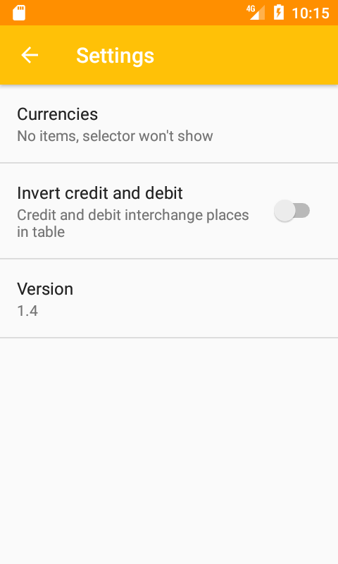
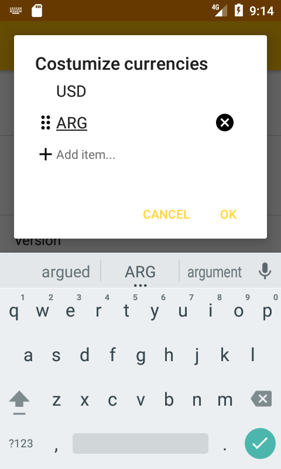
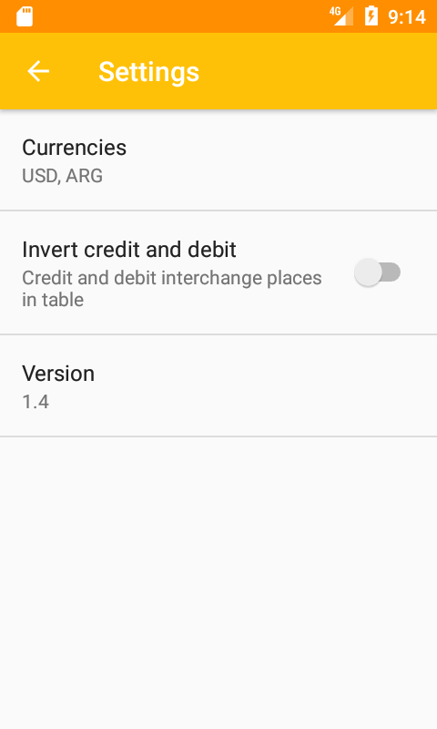
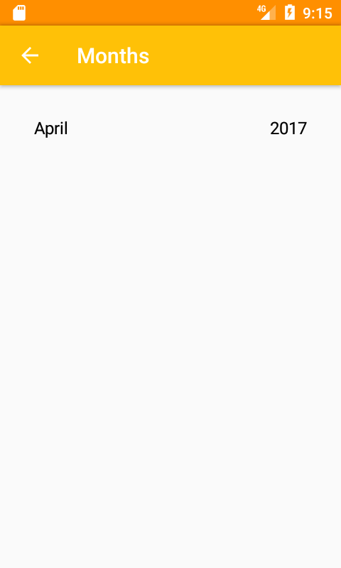
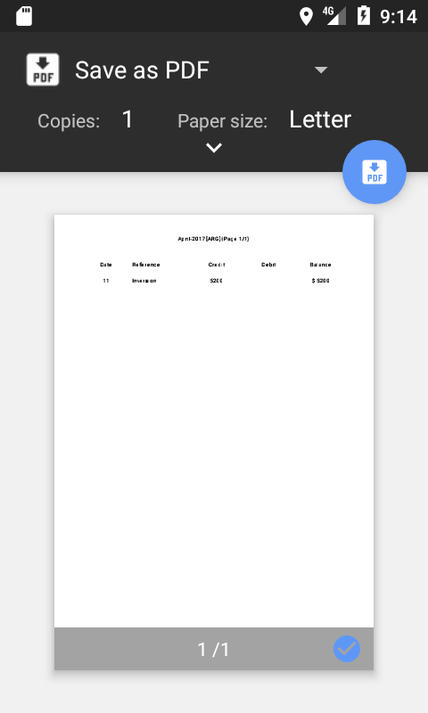

# Simple-Accounting
Android app that helps you balance: https://play.google.com/store/apps/details?id=com.emmanuelmess.simpleaccounting

### Main
   

### Settings
  

### Month selection

### Printing

